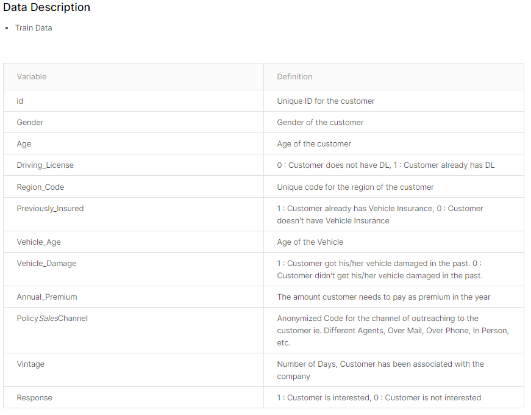

# Health Insurance Cross Sell Prediction

Predict Health Insurance Owners' who will be interested in Vehicle Insurance

> 数据挖掘kaggle：https://www.kaggle.com/datasets/anmolkumar/health-insurance-cross-sell-prediction

## 题目背景：

这是一家为客户提供健康保险的保险公司，现在他们需要你的帮助来建立一个模型来预测过去一年的投保人（客户）是否也会对公司提供的汽车宝贤感兴趣。

## 分析目标

通过已投健康保险的客户的个人以及车辆信息，来预测该客户是否对公司提供的汽车保险感兴趣。

#### 数据情况：

训练集：304888条

测试集：76221条

#### 评价指标

AUC，ROC曲线下的面积